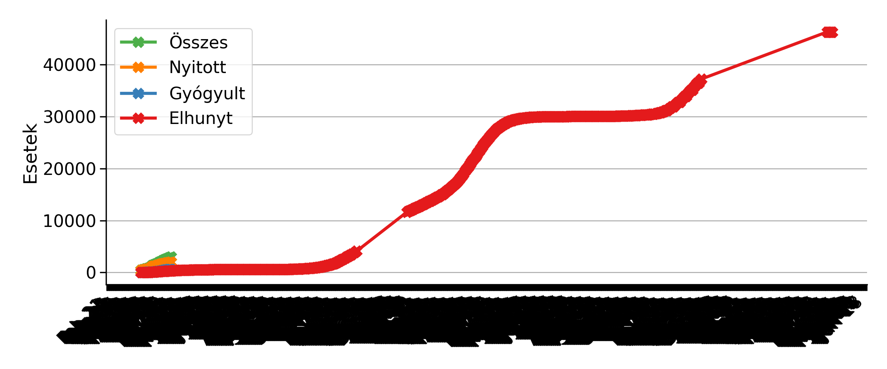
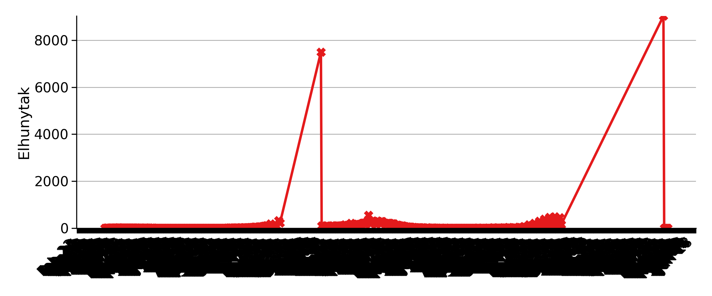
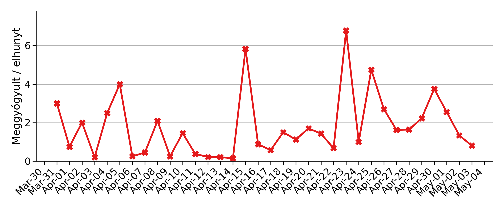
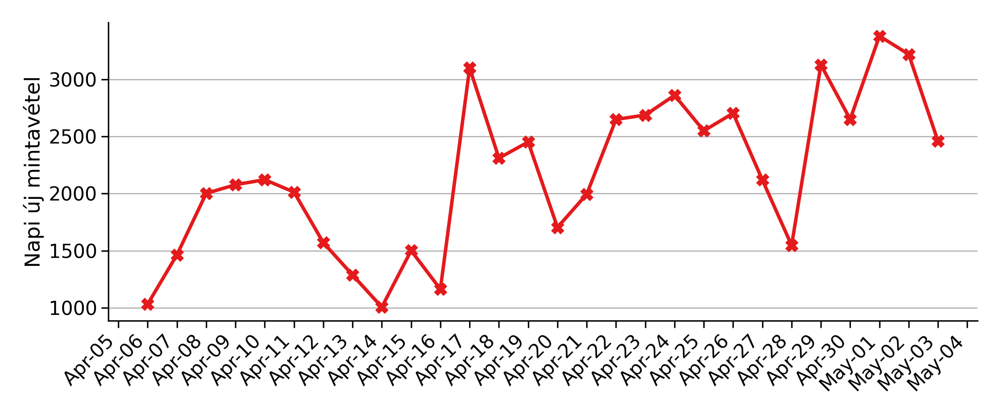
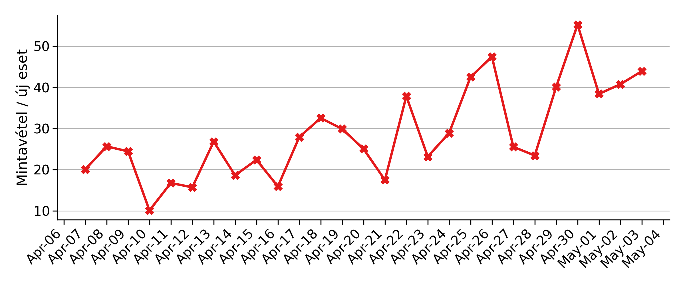
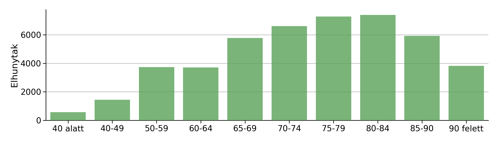
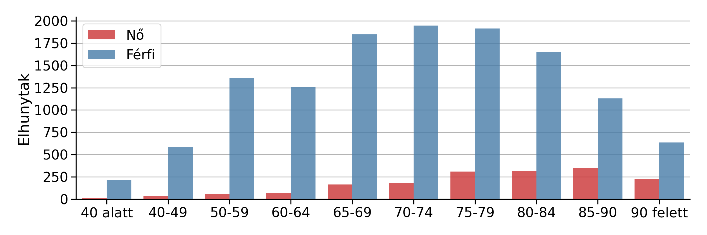
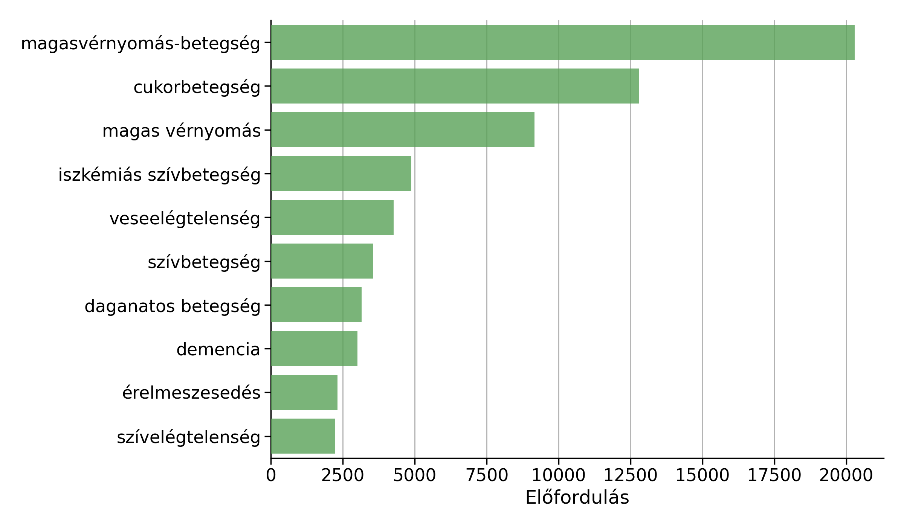
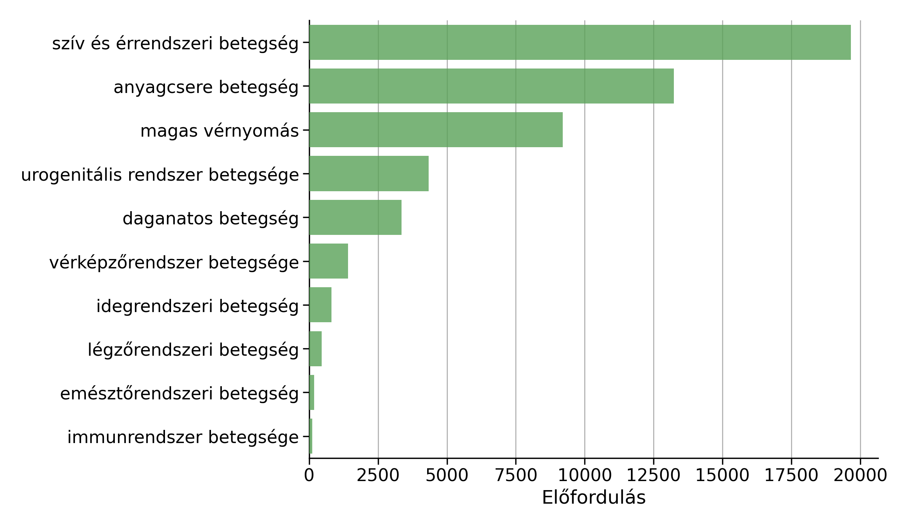

# Magyar koronavírus statisztikák

Az itt látható statisztikák a [koronavirus.gov.hu/elhunytak](https://koronavirus.gov.hu/elhunytak) oldalon található táblázat és a főoldalon lévő számok alapján készültek.
Az ábrák egyesével megtalálhatók a [fig](fig) könyvtárban, az ábrákat előállító kód pedig [itt](hungary_analysis.ipynb) érhető el.

Az orvosi információk feldolgozásában Lauter Beatrix segített.

Készítette: Ács Judit

## Összes regisztrált eset, nyitott esetek, gyógyultak, elhunytak

## Összes elhunyt száma nemek szerint

## Újonnan elhunytak száma

A hivatalos adatok reggelente frissülnek, az ábra az x-tengelyen lévő nap előtti reggeltől aznap reggelig elhunytak számát ábrázolja.

## Gyógyultak és elhunytak aránya naponta

Előző nap óta meggyógyult és elhunyt betegek aránya.

## Naponta elvégzett tesztek száma

## Tesztek és új esetek aránya

Hány tesztből lett egy pozitív.

## Korcsoportonként

## Korcsoportonként és nemenként

# Alapbetegségek

Az alapbetegségeket igyekeztünk egységesíteni.
Az összerendelések [itt](name_mapping.tsv) érhetők el.

## Alapbetegségek számának hisztogramja

Az ábra azt mondja meg, hogy hány olyan beteg van, akinek 0, 1 stb. alapbetegsége van.
Egy beteghez 7 alapbetegség volt beírva, ez eddig a legmagasabb szám.

A "adat feltöltése folyamatban" és a "nincs adat" mezőket NA-hoz soroltuk.

## 10 leggyakoribb alapbetegség

Az alapbetegségek különböző részletességgel szerepelnek, pl. iszkémiás szívbetegség, máshol csak szív és érrendszeri betegség.

## Betegségek osztályzása és az előfordulások száma

A betegségeket a [Betegségek nemzetközi osztályozása](https://hu.wikipedia.org/wiki/Betegs%C3%A9gek_nemzetk%C3%B6zi_oszt%C3%A1lyoz%C3%A1sa) szerint kategorizáltuk, kivéve a magas vérnyomást, amit külön kategóriának vettünk.
A kategorizálás [itt](categories.tsv) érhető el.

# Feedback

Hibát találtál? Fejlesztési javaslatod van? Kérlek adj fel egy [Github issue-t](https://github.com/juditacs/koronavirus/issues).

